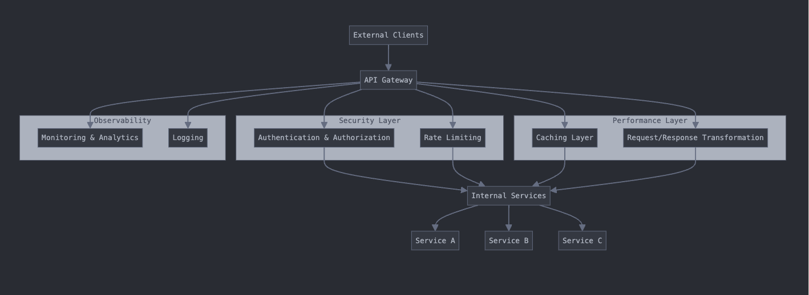
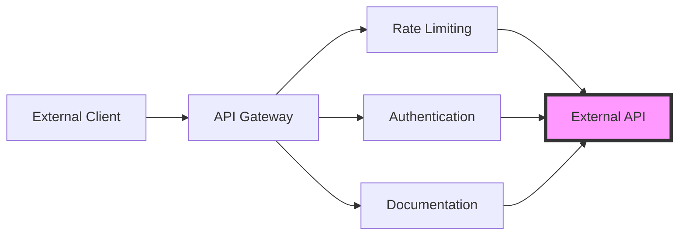
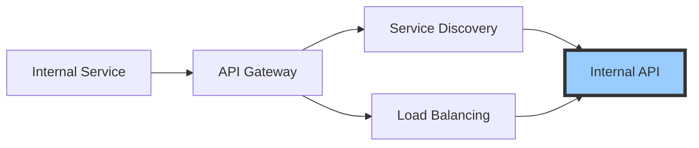
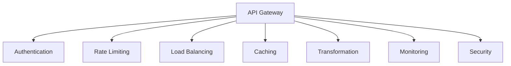
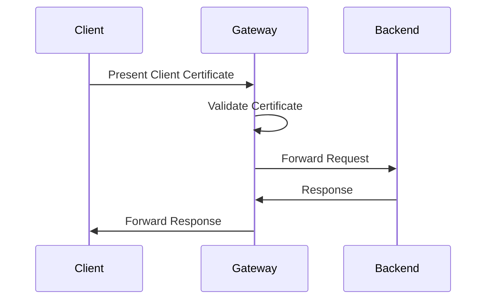
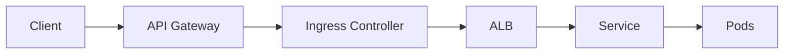

# Understanding API Gateway: A Comprehensive Guide

## Table of Contents
1. [Introduction](#introduction)
2. [External vs Internal APIs](#external-vs-internal-apis)
3. [Need for API Gateway](#need-for-api-gateway)
4. [Key Features and Uses](#key-features-and-uses)
5. [Advantages and Disadvantages](#advantages-and-disadvantages)
6. [Security Aspects](#security-aspects)
7. [Request Flow Architecture](#request-flow-architecture)
8. [Implementation Example](#implementation-example)

## Introduction

An API Gateway acts as a reverse proxy to accept all application programming interface (API) calls, aggregate the various services required to fulfill them, and return the appropriate result. It serves as a single entry point into a system, encapsulating the internal system architecture and providing an API that is tailored to each client.

## Architecture


## External vs Internal APIs

### External APIs
External APIs are designed for consumption by external clients, third-party developers, partners, or public users. They have specific characteristics:



Key characteristics:
- Public-facing endpoints
- Strict versioning
- Comprehensive documentation
- Heavy security measures
- Rate limiting and throttling
- Monetization capabilities
- Performance optimization

### Internal APIs
Internal APIs are meant for use within the organization or between different services of the same application.



Key characteristics:
- Private network access only
- Looser versioning requirements
- Simplified documentation
- Basic authentication
- Higher trust level
- Focus on functionality over security

## Need for API Gateway

1. **Unified Entry Point**
   - Single point of entry for all clients
   - Consistent interface regardless of backend architecture

2. **Security**
   - Centralized authentication and authorization
   - Protection against common threats
   - SSL termination

3. **Performance**
   - Response caching
   - Request/response transformation
   - Load balancing

4. **Monitoring**
   - Centralized logging
   - Analytics and metrics
   - Error tracking

## Key Features and Uses



## Advantages and Disadvantages

### Advantages
1. **Centralized Control**
   - Single point for policy enforcement
   - Easier management and updates
   - Consistent security implementation

2. **Improved Performance**
   - Caching capabilities
   - Request aggregation
   - Response transformation

3. **Better Security**
   - Centralized authentication
   - Token validation
   - Rate limiting

4. **Analytics & Monitoring**
   - Unified logging
   - Comprehensive metrics
   - Easy troubleshooting

### Disadvantages
1. **Single Point of Failure**
   - Requires high availability setup
   - Need for proper failover mechanisms

2. **Additional Latency**
   - Extra network hop
   - Processing overhead

3. **Complexity**
   - Additional infrastructure to maintain
   - More complex deployment process

4. **Resource Intensive**
   - Requires significant computing resources
   - Higher operational costs

## Security Aspects

### Client Certificates
Client certificates (mutual TLS authentication) provide a way to authenticate clients at the transport layer:



Implementation example:

```yaml
apiVersion: networking.k8s.io/v1
kind: Ingress
metadata:
  annotations:
    nginx.ingress.kubernetes.io/auth-tls-verify-client: "on"
    nginx.ingress.kubernetes.io/auth-tls-secret: "default/ca-secret"
spec:
  rules:
    - host: api.example.com
      http:
        paths:
          - path: /
            pathType: Prefix
            backend:
              service:
                name: api-service
                port:
                  number: 80
```

### Other Security Measures
1. **Authentication**
   - JWT validation
   - OAuth2 integration
   - API keys

2. **Authorization**
   - Role-based access control
   - Scope-based permissions
   - IP whitelisting

3. **Threat Protection**
   - SQL injection prevention
   - XSS protection
   - Request size limiting

## Request Flow Architecture

Here's how requests flow from API Gateway to Application Load Balancer (ALB) in a Kubernetes environment:



Example implementation:

```yaml
# API Gateway Configuration
apiVersion: networking.k8s.io/v1
kind: Ingress
metadata:
  name: api-gateway
  annotations:
    kubernetes.io/ingress.class: "nginx"
    alb.ingress.kubernetes.io/scheme: "internet-facing"
    alb.ingress.kubernetes.io/target-type: "ip"
spec:
  rules:
  - host: api.example.com
    http:
      paths:
      - path: /api/v1
        pathType: Prefix
        backend:
          service:
            name: internal-alb
            port:
              number: 80

---
# ALB Service Configuration
apiVersion: v1
kind: Service
metadata:
  name: internal-alb
  annotations:
    service.beta.kubernetes.io/aws-load-balancer-internal: "true"
spec:
  type: LoadBalancer
  ports:
  - port: 80
    targetPort: 8080
  selector:
    app: backend-service
```

## Implementation Example

Let's create a simple API Gateway implementation using Node.js and Express:

```javascript
const express = require('express');
const rateLimit = require('express-rate-limit');
const jwt = require('jsonwebtoken');
const proxy = require('http-proxy-middleware');

const app = express();

// Rate limiting middleware
const limiter = rateLimit({
  windowMs: 15 * 60 * 1000, // 15 minutes
  max: 100 // limit each IP to 100 requests per windowMs
});

// Authentication middleware
const authenticateJWT = (req, res, next) => {
  const authHeader = req.headers.authorization;

  if (authHeader) {
    const token = authHeader.split(' ')[1];

    jwt.verify(token, process.env.JWT_SECRET, (err, user) => {
      if (err) {
        return res.sendStatus(403);
      }

      req.user = user;
      next();
    });
  } else {
    res.sendStatus(401);
  }
};

// Proxy configuration
const apiProxy = proxy.createProxyMiddleware({
  target: 'http://internal-alb.default.svc.cluster.local',
  changeOrigin: true,
  pathRewrite: {
    '^/api/v1': '/'
  }
});

// Apply rate limiting to all requests
app.use(limiter);

// Routes
app.use('/api/v1/public', apiProxy);
app.use('/api/v1/private', authenticateJWT, apiProxy);

// Error handling
app.use((err, req, res, next) => {
  console.error(err.stack);
  res.status(500).send('Something broke!');
});

const PORT = process.env.PORT || 3000;
app.listen(PORT, () => {
  console.log(`API Gateway listening on port ${PORT}`);
});
```

This implementation includes:
- Rate limiting
- JWT authentication
- Proxy to internal services
- Error handling
- Route-specific middleware

## Conclusion

API Gateway is a crucial component in modern microservices architecture, providing essential features for managing, securing, and monitoring APIs. While it adds some complexity and potential performance overhead, the benefits of centralized control, security, and monitoring usually outweigh these drawbacks. When implementing an API Gateway, carefully consider your specific requirements around security, performance, and scalability to choose the right configuration and features for your use case.
