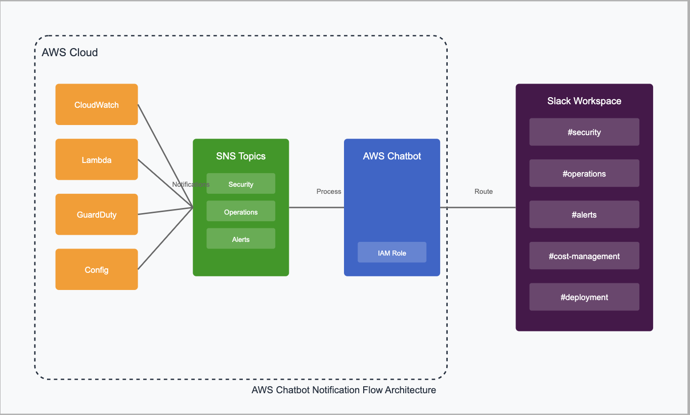

# Integrating AWS Chatbot with SNS and Slack for Multi-Channel Notifications

## Introduction

In modern cloud environments, effective notification management is crucial for maintaining operational awareness. AWS Chatbot provides a native integration between AWS services and collaboration platforms like Slack. This article explores how to configure AWS Chatbot to route notifications from various AWS services through SNS to different Slack channels efficiently.

## Architecture Overview

Let's understand the high-level architecture of our notification system using AWS Chatbot:




## Components Overview

1. **AWS SNS Topics**: Central message aggregation points
2. **AWS Chatbot**: Managed service handling message routing and formatting
3. **Source Services**: AWS services generating notifications
4. **Slack Workspace**: Destination for categorized notifications
5. **IAM Roles**: Permission management for AWS Chatbot

## Implementation Guide

### 1. Setting up AWS Chatbot

1. **Configure Slack Integration**:
```bash
# First, create the required IAM role
aws iam create-role \
    --role-name AWSChatbotRole \
    --assume-role-policy-document '{
        "Version": "2012-10-17",
        "Statement": [{
            "Effect": "Allow",
            "Principal": {
                "Service": "chatbot.amazonaws.com"
            },
            "Action": "sts:AssumeRole"
        }]
    }'
```

2. **Create SNS Topics**:
```bash
# Create separate topics for different notification types
aws sns create-topic --name alert-notifications
aws sns create-topic --name security-notifications
aws sns create-topic --name operations-notifications
```

3. **Configure AWS Chatbot in Console**:
- Navigate to AWS Chatbot console
- Select "Configure new client"
- Choose Slack as the client type
- Follow OAuth process to connect to your Slack workspace

### 2. Channel Configuration

Configure multiple Slack channels with different permission sets:

```json
// Example IAM policy for security notifications
{
    "Version": "2012-10-17",
    "Statement": [
        {
            "Effect": "Allow",
            "Action": [
                "sns:ListTopics",
                "sns:Subscribe",
                "guardduty:GetFindings",
                "securityhub:GetFindings"
            ],
            "Resource": "*"
        }
    ]
}
```

### 3. Setting up Channel Mappings

Configure AWS Chatbot channel mappings in the console:

1. **Security Channel Configuration**:
   - Channel: #security
   - SNS Topics: security-notifications
   - IAM Role: SecurityNotificationsRole
   - Allowed Notifications: GuardDuty, Security Hub, IAM

2. **Operations Channel Configuration**:
   - Channel: #operations
   - SNS Topics: operations-notifications
   - IAM Role: OperationsNotificationsRole
   - Allowed Notifications: CloudWatch, Config, Systems Manager

3. **General Alerts Channel Configuration**:
   - Channel: #alerts
   - SNS Topics: alert-notifications
   - IAM Role: GeneralNotificationsRole
   - Allowed Notifications: All remaining services

## Message Routing Strategy

### 1. Topic-Based Routing

Configure different SNS topics for different notification types:

```python
# Example of publishing to specific topics based on message type
import boto3

def publish_notification(message_type, message):
    sns = boto3.client('sns')
    
    topic_mapping = {
        'security': 'arn:aws:sns:region:account-id:security-notifications',
        'operations': 'arn:aws:sns:region:account-id:operations-notifications',
        'alerts': 'arn:aws:sns:region:account-id:alert-notifications'
    }
    
    sns.publish(
        TopicArn=topic_mapping[message_type],
        Message=message,
        MessageAttributes={
            'Type': {
                'DataType': 'String',
                'StringValue': message_type
            }
        }
    )
```

### 2. Service-Specific Configurations

Configure source services to publish to appropriate SNS topics:

```json
// CloudWatch Alarm Example
{
    "AlarmName": "HighCPUUtilization",
    "AlarmActions": [
        "arn:aws:sns:region:account-id:operations-notifications"
    ]
}
```

## Advanced Features

### 1. Message Formatting

AWS Chatbot automatically formats messages based on the source service. You can enhance this with SNS message attributes:

```json
{
    "detail-type": "AWS API Call via CloudTrail",
    "source": "aws.guardduty",
    "detail": {
        "severity": "HIGH",
        "description": "Suspicious API activity detected"
    }
}
```

### 2. Commands and Interactions

AWS Chatbot supports various slash commands in Slack:

```plaintext
/aws help
/aws apps list
/aws cloudwatch show-alarms
/aws config list-resources
```

## Advantages

1. **Managed Service**: No infrastructure to maintain
2. **Native Integration**: Deep integration with AWS services
3. **Secure**: IAM-based access control
4. **Scalable**: Handles high message volumes
5. **Cost-Effective**: Pay-as-you-go pricing
6. **Interactive**: Supports command execution from Slack

## Challenges and Solutions

### 1. Message Volume Management

**Challenge**: High volume of notifications can overwhelm channels.

**Solution**: 
- Use message filtering in SNS
- Configure notification throttling
- Implement severity-based routing

```json
// SNS Filter Policy Example
{
    "severity": ["HIGH", "CRITICAL"],
    "service": ["guardduty", "securityhub"]
}
```

### 2. Permission Management

**Challenge**: Managing fine-grained permissions across channels.

**Solution**: 
- Create channel-specific IAM roles
- Use AWS Organizations for centralized management
- Implement least-privilege access

## Best Practices

1. **Channel Organization**:
   - Use clear channel naming conventions
   - Separate critical and non-critical notifications
   - Create channel-specific notification preferences

2. **Security**:
   - Regularly audit IAM permissions
   - Enable AWS CloudTrail logging
   - Use encrypted SNS topics

3. **Monitoring**:
   - Set up dead-letter queues for failed notifications
   - Monitor notification delivery metrics
   - Configure alert thresholds

4. **Documentation**:
   - Maintain channel purpose documentation
   - Document message routing rules
   - Keep command reference guides

## Cost Optimization

1. **Message Filtering**:
   - Implement SNS message filtering
   - Use appropriate CloudWatch metric periods
   - Configure meaningful alarm thresholds

2. **Resource Allocation**:
   - Monitor AWS Chatbot usage
   - Optimize number of channels
   - Review and adjust notification frequency

## Conclusion

AWS Chatbot provides a robust, managed solution for routing AWS service notifications to Slack channels. By following this guide and implementing the suggested best practices, organizations can build a reliable, secure, and efficient notification system that enhances their operational awareness and incident response capabilities.

## Additional Resources

1. AWS Chatbot Documentation
2. SNS Developer Guide
3. Slack API Documentation
4. AWS Security Best Practices
5. CloudWatch Documentation
